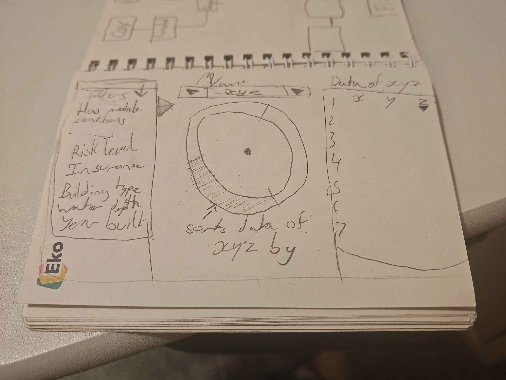
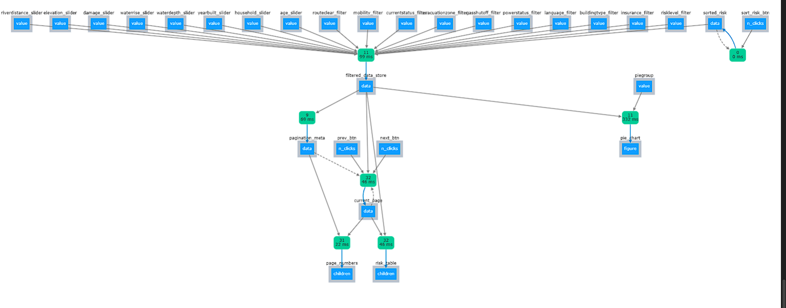
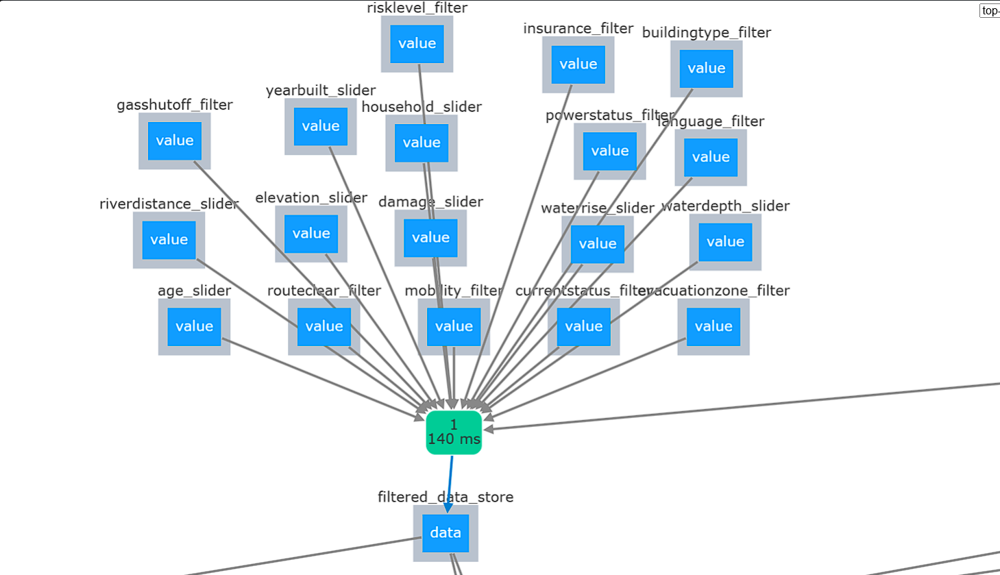
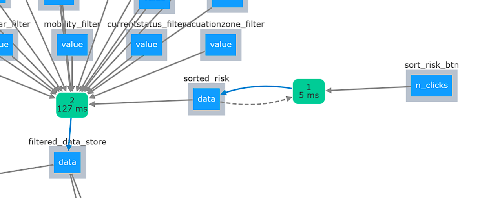
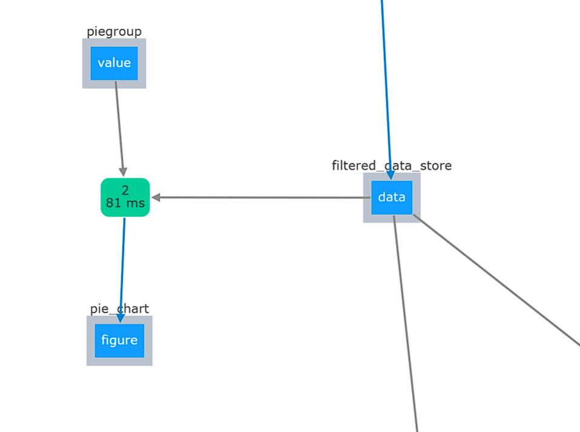
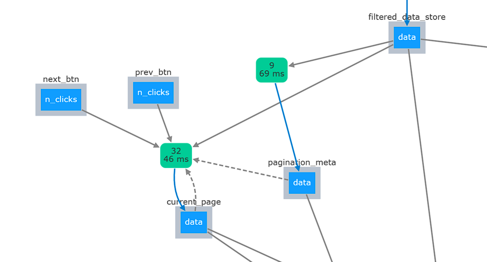
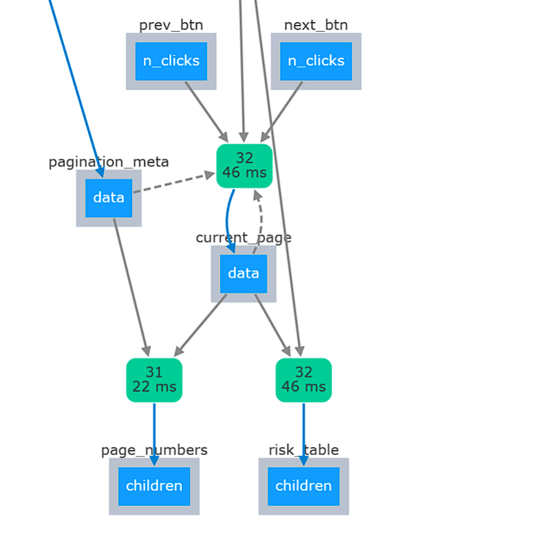
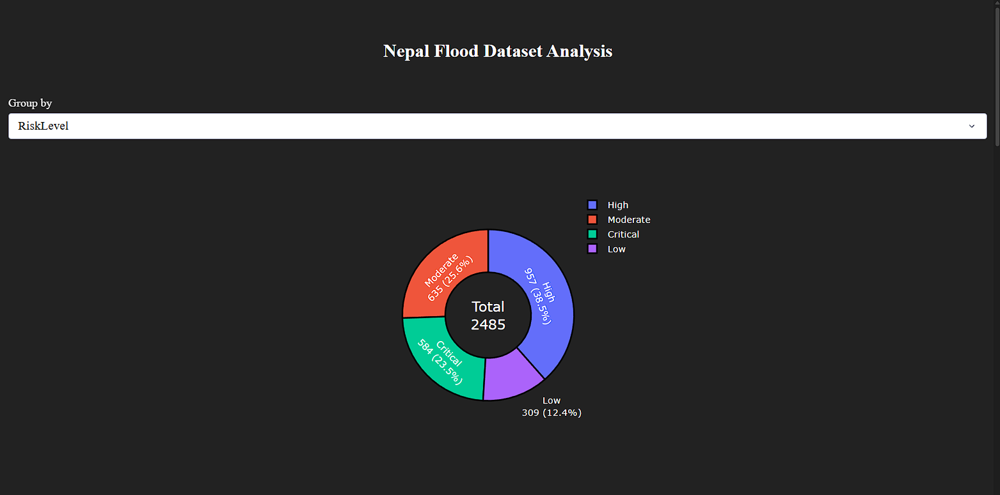

# Flood-Data-Dashboard-using-plotly-dash

  
https://youtu.be/ozsbJdAmBCU  
Dutch Exchange submission
Flood Dashboard Report  
Wire frames:

System architecture:

FILTERS:
All of the filters are used as an input for the callback which updates the data for the piechart and table.

At this stage the filtered data is either sorted by the risk level or not based on a boolean controlled by a button.

When “piegroup” or “filtered_data_store” is altered there is another callback which updates the piechart.

This next section keeps track of the current page of the table that the user is viewing and resets it to zero when “filtered_data_store” is modified.

This information is passed down along with the filtered data to be displayed in a more readable format.

Testing:
I used Claude to create automated test cases for the program which can be seen in the appendix.

EVALUATION:
Justification of design choices:
I think that the dark mode visuals are appealing, The pie chart makes it easy to get a quick overview of the general situation and filtering makes it easy for the user to prioritise those in need.

Code review and performance:
In the filtering there are more computations than needed. For every singular filter change all others are being re-applied to the base and then the entire thing is stored. It might have been better to store the filters and apply those on update to the df directly. Pagination should also be done server side as the user doesn’t need to receive the entire filtered data.

User guide:
The filters are drop down menus or sliders so they are intuitive to understand. Many of them can be selected at once so that you can get a deeper understanding.

The pie chart also has a drop down menu which allows you to group the data on top of the filters.

The Risk Table shows people's information and their current risk level.
You can go forwards and back on pages as well as sort the data by the risk level.

Future additions and improvements:
It would have been cool to click on the pie chart and filter the data on the risk table by one or multiple subcategories. This was something I attempted to do but it was too inconsistent and wasn't clear enough when using the default plotly pie chart.

Appendix
Use of AI:
YES

It's ctrl+shift + V to preview a md file in VSC oops...
